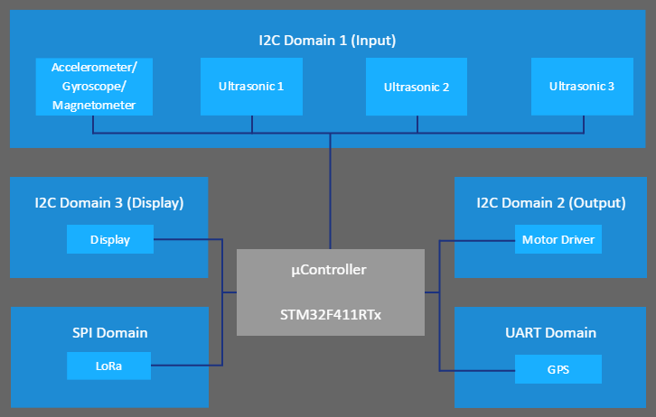

# eLSA - The embedded Land Surveying Automaton

## Introduction

The eLSA platform is a software solution for user specific land surveying applications. The eLSA platform itself provides handling of autonomous driving to waypoints,
hazard detection, malfunction report and communication with an operator. The platform can be used to extend the capability of an eLSA Robot through the given eLSA Layer, while
it still provides access to hardware components.

### Architecture

In this section we want to take a detailed look at the eLSA Layer Architecture, which consists of 5 layers. 


#### User Application

This is the user level application. The layer has access to eLSA specific components like the communication link or hazard detection but also to externally defined hardware
components like sensors and actuators. Thus it is possible to extend the eLSA application for custom uses.

#### eLSA Application

The eLSA Application is the functioning layer of the eLSA platform and contains the logic of an eLSA robot. It handles the waypoint management, the movement control while considering
obstacles and hazards and reporting mechanism through the communication link.

#### eLSA HAL

This is the HAL at the eLSA side. The eLSA platform is hardware and platform independent. The reason is because of this layer. The layer defines rules and interfaces, which
must be implemented from the lower layer, so that the eLSA Application can use these implementations.

#### eLSA User HAL

The eLSA User HAL is the user implementation of the eLSA HAL. It just provides an abstraction to the hardware for the eLSA HAL. In this layer, it is possible to use middleware
like RTOS.

#### Hardware

This is the hardware layer with all the possible hardware components for the application and their communication protocols and interfaces.

## Tools

The list represents the used tools within the project.

Name                         | Description
-----------------------------|-----------------------------------------------------------------------------
Visual Paradigm Community    | All-in-one modelling tool, which was used in the project for SysML-Modeling
Pencil Project               | Diagram modelling tool for simple diagrams
Docsify                      | JavaScript application to display markdown written documenmts on GitHub Pages
Doxygen                      | Documentation site generator for C++-Code
Atollic TrueSTUDIO for STM32 | Eclipse based IDE for embedded systems development in use for C++-Coding and debug
STM32CubeMX                  | TrueStudio-Plugin: C code generator and configurator for STM32 microcontroller platform


## Requirement Diagrams

## Block Diagrams

## State Diagrams

## Class Diagrams

## Hardware - eLSA Robot

This section shows the used hardware and their configurations in detail.

### Parts

#### µController-Board

| Description                 | Note | Distributor | Article No.  | Count |
| --------------------------- | ---  | ----------- | ------------ | ----- |
| STM32 Nucleo 64 Basis-Board | µC   | Conrad      | 1416928 - 62 | 1     |

#### Chassis

| Description                | Note    | Distributor | Article No. | Count |
| -------------------------- | --------| ----------- | ----------- | ----- |
| Roboterchassis Arexx RP5/6 | chassis | Conrad      | 191152 - 62 | 1     |

#### Actuators

| Description                         | Note          | Distributor | Article No.   | Interface | Count |
| ----------------------------------- | ------------- | ----------- | ------------- | --------- | ----- |
| Adafruit Motor/Stepper/Servo Shield | motor control | Mouser      | 485 - 1438    | I2C       | 1     |
| Display 128x32 I2C OLED             | display       | Mouser      | 485 - 931     | I2C       | 1     |

#### Sensors

| Description                         | Note                            | Distributor   | Article No. | Interface     | Count |
| ----------------------------------- | ------------------------------- | ------------- | ----------- | ------------- | ----- |
| Adafruit Ultimate GPS Logger Shield | GPS                             | Mouser        | 485 - 1438  | UART          | 1     |
| Adafruit 9-DOF Accel/Mag/Gyro       | acceleration sensing            | Mouser        | 485-3387    | I2C, SPI      | 1     |
| SRF02 I2C Ultraschall-Sensor        | ultrasonic distance measurement | Robotshop.com | RB-Dev-20   | I2C           | 1     |
| Sharp GP2Y0D805Z0F IR-Sensor        | optical distance measurement    | Robotshop.com | RB-Pol-158  | Analog        | 3     |
| DFRobot Moisture Sensor             | humidity                        | Robotshop.com | RB-Dfr-161  | Widerstand    | 1     |

#### Communication

| Description         | Note    | Distributor | Article No. | Interface     | Count |
| ------------------- | ------- | ----------- | ----------- | ------------- | ----- |
| Adafruit LoRa Modul | LoRa    | Mouser      | 485-3072    | SPI           | 1     |

#### Power Supply

| Description                                            | Note            | Distributor | Article No. | Count |
| ------------------------------------------------------ | --------------- | ----------- | ----------- | ----- |
| Conrad energy Modellbau-Akkupack (NiMh) 7.2 V 3000 mAh | motor batteries | Conrad      | 206028 - 62 | 1     |

#### Miscellaneous

| Description                          | Note                              | Distributor | Article No. | Count |
| ------------------------------------ | --------------------------------- | ----------- | ----------- | ----- |
| GPS Antenna                          | to be determined                  |             |             |       |
| Casing                               | to be determined                  |             |             |       |

### Domains

The hardware is split into 5 bus domains, while the microcontroller holds a special place as the central hardware component.
It shows the logical relations and their interfaces to the microcontroller. It helps to have an overview of all the used
components in general.



Domain                 | Function
-----------------------|-----------
I2C Domain 1 (Input)   | simple I2C devices, simple inputs
I2C Domain 2 (Output)  | simple I2C devices, simple outputs
I2C Domain 3 (Display) | i2c devices for display specific output
SPI Domain             | spi devices with more complex functions (e.g. protocols)
UART Domain            | uart devices with more complex functions (e.g. protocols)

### Configuration

The configuration of the microcontroller was done with the STM32CubeMX plugin, which generated this document. The document contains the pinout,
clock tree and middleware configuration.

```pdf
	hardware/mcuBoard/eLSA_RobotHwConfig.pdf
```

#### Bus domains and address tables

The following tables are describing the bus domains and address usage for the multiple peripherals used on eLSA.
Since the standard hardware implementation uses a STM32 Nucleo-F411RE Board the given interfaces are specific to this board respectively the STM32F411RETx MCU.
The same applies to the bus addresses which are specific to the used devices.

##### I2C Domain 1 (Input)

| Peripheral / Functionality | Device                                                    | AddressBYTE (Read/Write) |
| -------------------------- | :-------------------------------------------------------- | :----------------------: |
| Accelerometer              | Analog Devices ADXL345 (on Sparkfun 9DoF Stick SEN-10724) |        0x3A/0x3B         |
| Magnetometer (Compass)     | Honeywell HMC5883L (on Sparkfun 9DoF Stick SEN-10724)     |        0x3D/0x3C         |
| Gyroscope                  | InvenSense ITG-3200 (on Sparkfun 9DoF Stick SEN-10724)    |        0xD0/0xD1         |
| supersonic distance 1      | Robot Electronics SRF02                                   |        0xE0/0xE1         |
| supersonic distance 2      | Robot Electronics SRF02                                   |        0xE2/0xE3         |
| supersonic distance 3      | Robot Electronics SRF02                                   |        0xE4/0xE5         |

##### I2C Domain 2 (Output)

| Peripheral / Functionality | Device                    | AddressBYTE (Read/Write) |
| -------------------------- | ------------------------- | :----------------------: |
| Motordrivers               | Adafruit Motorshield v2.3 |        0x60/0x61         |

##### I2C Domain 3 (Display)

| Peripheral / Functionality | Device                   | AddressBYTE (Read/Write) |
| -------------------------- | ------------------------ | :----------------------: |
| Display                    | Adafruit 128x32 I2C OLED |        0x78/0x79         |

##### SPI Domain

| Peripheral / Functionality | Device                       |                Address                 |
| -------------------------- | ---------------------------- | :------------------------------------: |
| LoRa Communication         | Dragino LoRa/GPS Shield v1.3 | [p2p connection - no slave select pin] |

##### UART Domain

| Peripheral / Functionality | Device                       |     Address      |
| -------------------------- | ---------------------------- | :--------------: |
| GPS                        | Dragino LoRa/GPS Shield v1.3 | [p2p connection] |

### Datasheets

This section contains relevant datasheets for the used hardware.

#### Adafruit Monochrome 128x32 I2C OLED

```pdf
	hardware/peripherals/datasheets/Adafruit_Monochrome_128x32_I2C_OLED/SSD1306_DisplayController.pdf
```

#### Adafruit MotorShield v2_3

##### PCA9685 PWM Controller
```pdf
	hardware/peripherals/datasheets/Adafruit_MotorShield_v2_3/PCA9685_PWM_Controller.pdf
```

##### TB6612FNG MotorDriver
```pdf
	hardware/peripherals/datasheets/Adafruit_MotorShield_v2_3/TB6612FNG_MotorDriver.pdf
```

#### Dragino LoRa GPS Shield

##### Quectel L80 GPSSensor

Documentation for hardware design and PMTK protocol specification.

```pdf
	hardware/peripherals/datasheets/Dragino_LoRa_GPS_Shield/Quectel_L80_Hardware_Design_V1.1_GPSSensor.pdf
```

```pdf
	hardware/peripherals/datasheets/Dragino_LoRa_GPS_Shield/Quectel_L80_GPS_Protocol_Specification.pdf
```

#### RobotElectronics SRF02 Ultrasonic Distance Measurement

Documentation file and beam pattern of the sensor.

```pdf
	hardware/peripherals/datasheets/RobotElectronics_SRF02_UltrasonicDistanceMeasurement/srf02.pdf
```


#### Sparkfun SEN10724 9DOF

##### ADXL345 Accelerometer
```pdf
	hardware/peripherals/datasheets/Sparkfun_SEN10724_9DOF/ADXL345_Accelerometer.pdf
```

##### HMC5883L FDS Digital Compass
```pdf
	hardware/peripherals/datasheets/Sparkfun_SEN10724_9DOF/HMC5883L_FDS_DigitalCompass.pdf
```

##### ITG 3200 rev1_4 Gyroscope
```pdf
	hardware/peripherals/datasheets/Sparkfun_SEN10724_9DOF/ITG_3200_rev1_4_Gyroscope.pdf
```

##### SEN10724 9DoF Stick v13 Circuit
```pdf
	hardware/peripherals/datasheets/Sparkfun_SEN10724_9DOF/SEN10724_9DoF_Stick_v13_Circuit.pdf
```
